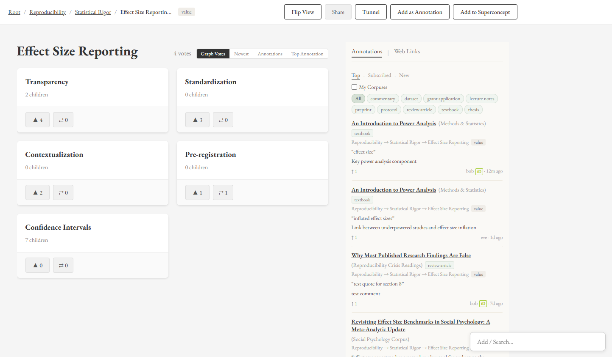

# Orca

A collaborative web platform for academic researchers to build shared concept hierarchies (ontologies) and annotate research documents.



## What is Orca?

Orca is a place where researchers and educators collaboratively organize the concepts that structure their fields. Users build hierarchical graphs of concepts, where the same concept name can live in very different contexts — a community decides how a concept fits into their hierarchy, and parallel arrangements coexist rather than compete. Every concept carries one of four attributes: **value**, **action**, **tool**, or **question**. Actions are the steps of a workflow, tools are the means by which actions are carried out, values represent motivations and principles, and questions capture open lines of inquiry.

On top of the graph, users upload research documents (preprints, grant applications, protocols, lecture notes) and annotate them against concepts-in-context. Annotations link a specific passage to a specific place in the concept graph, so a single document accumulates a layered reading from everyone who has engaged with it. Votes, annotations, concepts, and edges are permanent — Orca is append-only. Quality is curated through community voting and transparent moderation rather than deletion.

Orca is built for researchers who want to see how their colleagues organize ideas, for educators assembling shared reading lists across subfields, and for anyone interested in collaborative ontology-building as a public activity. The project's philosophical commitments are transparency (everything is attributed and public), productive contestation over forced consensus (disagreement is expressed by building parallel structures, not by overwriting), and community-driven curation (the people who use the graph decide how it should look).

## Key features

- Collaborative concept graphs with community voting on parent–child relationships
- Document annotations linking passages to specific concepts-in-context
- Cross-graph concept links via tunneling, for relationships that don't fit a parent–child model
- Superconcepts — named collections of concepts from across different graphs, for reading-list-style groupings
- Flip View for exploring every parent context a concept appears in
- Corpus-based document collections with per-corpus membership and invitation
- Version-aware document histories with co-authorship
- ORCID OAuth for verified researcher identity
- Append-only moderation with community flagging and transparent hide/show voting
- Per-user tabs, sidebar organization, and drag-and-drop grouping

## Live site

Live at [orcaconcepts.org](https://orcaconcepts.org) (launching soon).

## Tech stack

- **Frontend:** React + Vite
- **Backend:** Node.js + Express
- **Database:** PostgreSQL (with `pg_trgm` extension for fuzzy search)
- **File storage:** Cloudflare R2
- **Phone verification:** Twilio Verify
- **Researcher identity:** ORCID OAuth (optional)

## Running Orca locally

### Prerequisites

- Node.js v18 or later
- PostgreSQL v16 or later

### Setup

Clone the repository:

```bash
git clone https://github.com/orca-concepts/orca.git
cd orca
```

Install backend and frontend dependencies:

```bash
cd backend && npm install
cd ../frontend && npm install
```

Copy the environment template and fill in your local values (database credentials, JWT secret, Twilio keys, ORCID credentials):

```bash
cd ../backend
cp .env.example .env
```

Create the PostgreSQL database referenced in your `.env`, then run the migration to set up the schema:

```bash
npm run migrate
```

Start the backend dev server (auto-restart on changes):

```bash
npm run dev
```

In a second terminal, start the frontend dev server:

```bash
cd frontend
npm run dev
```

The app will be available at `http://localhost:3000`.

For a fuller reference — schema, API endpoints, architecture decisions, and phase history — see [ORCA_STATUS.md](ORCA_STATUS.md).

## Contributing

Contribution guidelines live in [CONTRIBUTING.md](CONTRIBUTING.md). Before submitting a pull request, please open an issue to discuss the change.

## License

Orca is licensed under the [GNU Affero General Public License v3.0](LICENSE) (AGPL v3). Under AGPL v3, anyone who runs a modified version of Orca as a network service must make the modified source code available to users of that service under the same license.

## Acknowledgments

Orca is built and maintained by a solo founder, with the possibility of transitioning to a nonprofit in the future. For questions, bug reports, or collaboration ideas, please open an issue on GitHub.
